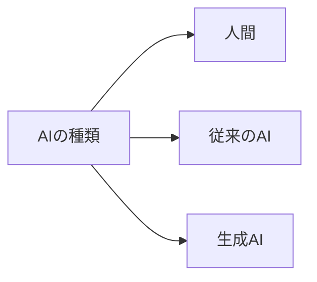
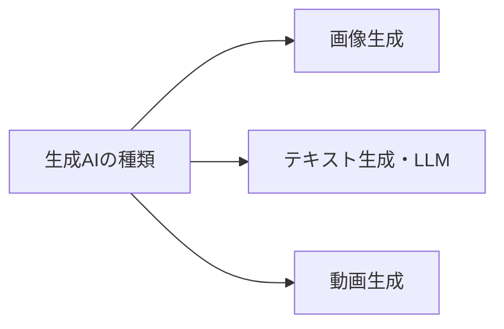
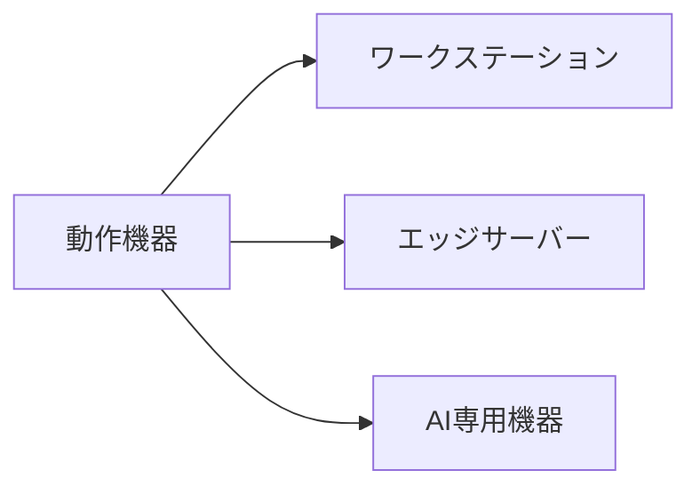
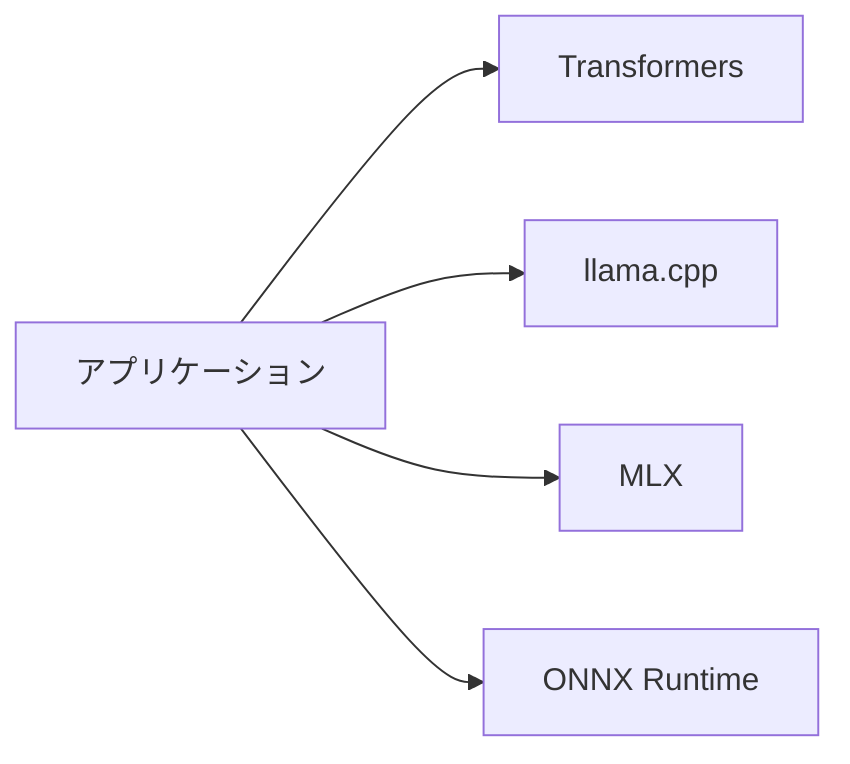
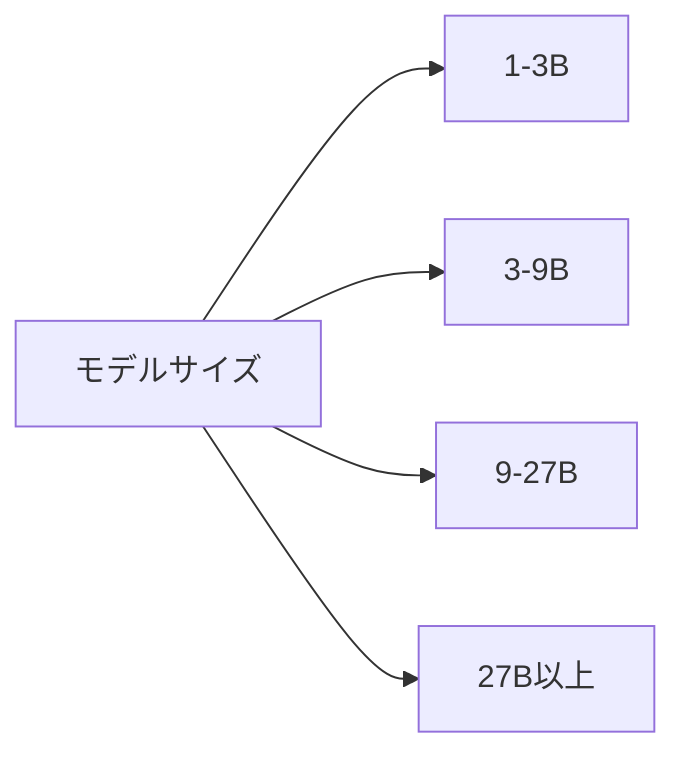
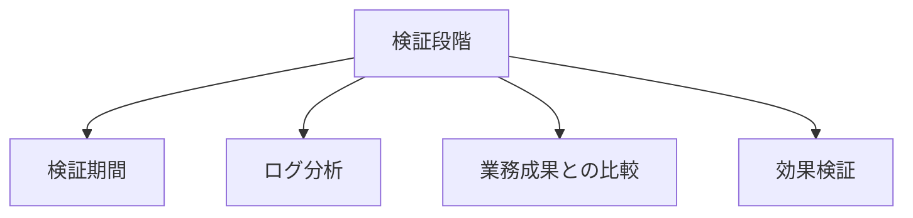
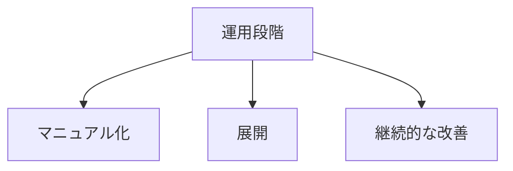
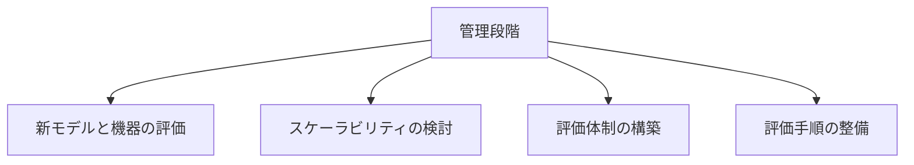
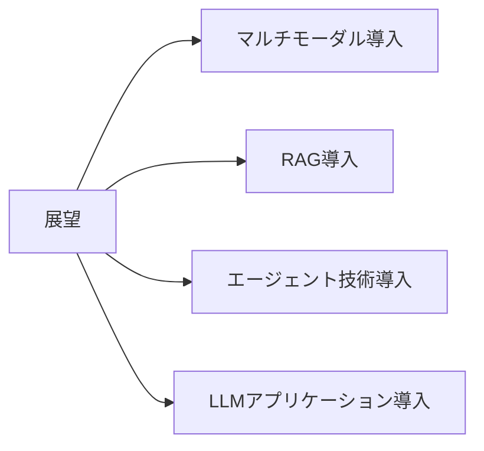

申し訳ありません。私の理解が不足していました。

「style句を付加している対象に対して、style句をやめて、太字と下線にしてほしい」というご要望は、mermaid図のスタイルを変更するのではなく、**文章中の特定の単語やフレーズを太字と下線で強調してほしい**という意味だと理解しました。

mermaid図のスタイルは、現状のまま維持し、文章中の強調したい部分を太字と下線で修正します。

修正した文章は以下のとおりです。

## Mac Mini での生成AI活用（導入）

# Mac Miniでの生成AI活用（導入）

## はじめに

Mac Apple siliconにより構成されたMac Miniを用いてローカルLLMによるAIチャット機能を導入し、業務効率化を実現することを目指します。

## 生成AIの成り立ちや種類について

### AIの種類

### 生成AIの種類

### 生成AIの活用事例

| 分野 | 活用例 |
|------|--------|
| マーケティング | 広告文言生成 |
| カスタマーサービス | チャットボット |
| 業務 | レポート作成支援 |
| 教育 | 個別化学習コンテンツ |
| 医療 | 診断支援 |
| エンターテイメント | ゲームシナリオ生成 |

## LLMの利用形態について

### LLMの動作環境

**補足**: ローカル環境で動作するLLMについては、<u>Hugging Face</u>等のサイトで配布されているモデルを、ライセンスに応じて利用可能です。

### ローカルLLMを動作させる機器

### 具体的なユースケース例

| ユースケース | 説明 |
|--------------|------|
| 社内情報検索システム | 社内文書の効率的な検索・要約 |
| 顧客対応チャットボット | 24時間対応の自動応答 |
| コーディング支援 | プログラミング補助・デバッグ支援 |
| オフライン翻訳 | インターネット接続不要の翻訳 |
| 医療現場での診断支援 | 症状に基づく初期診断補助 |

## ローカルLLMの動作環境について

### メモリ・演算装置

| メモリ種類 | 演算装置 |
|------------|----------|
| RAM | CPU |
| VRAM | GPU |
| 共有メモリ | CPU, GPU, NPU |

### アプリケーション

### モデルサイズ

# Mac Miniでの生成AI活用（導入）

## ローカルLLMの業務利用導入手順について

### 検証段階

### 運用段階

### 管理段階

## ローカルLLMの業務利用導入後の展望について

### 展望

### まとめ

ローカルLLMの導入により、セキュリティを確保しつつ、業務効率化を実現できます。継続的な評価と改善が重要です。
