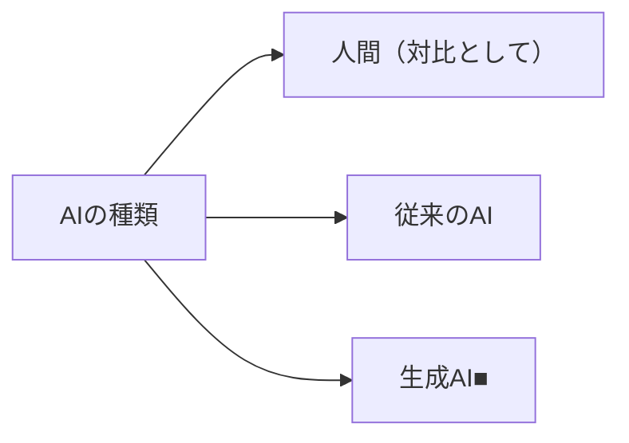
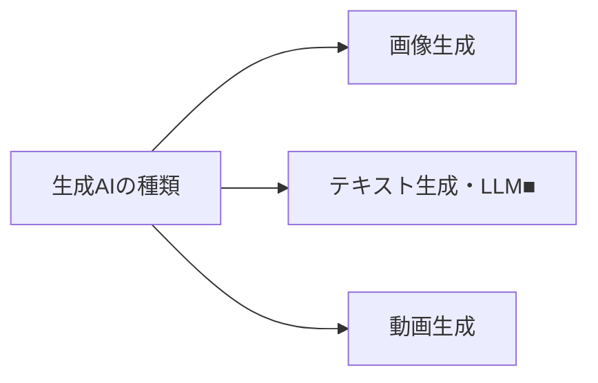
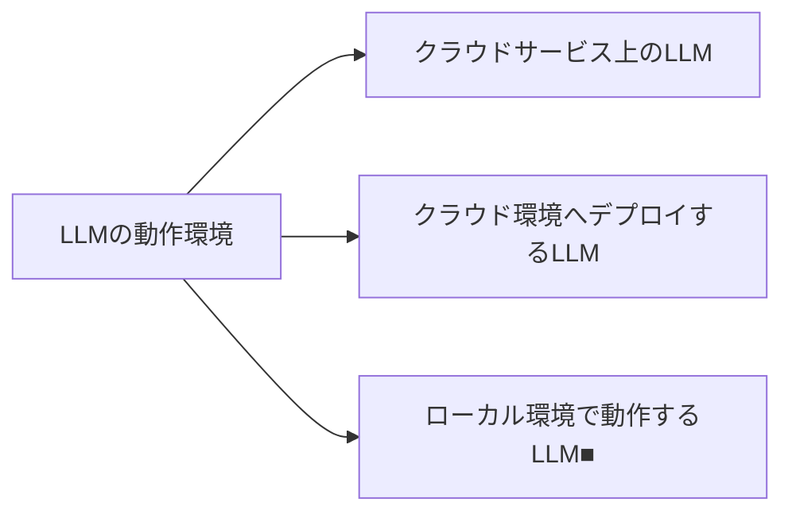
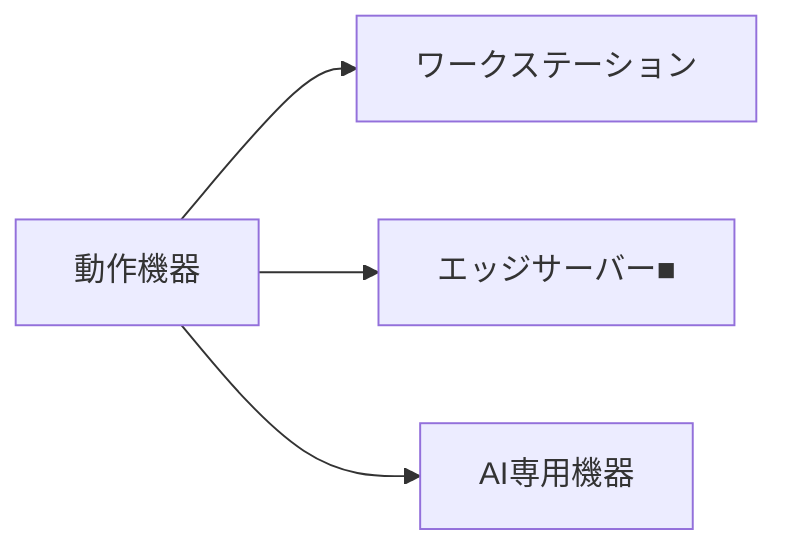
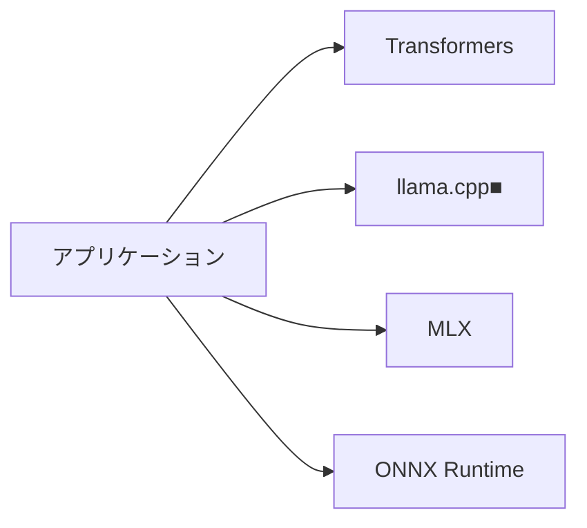
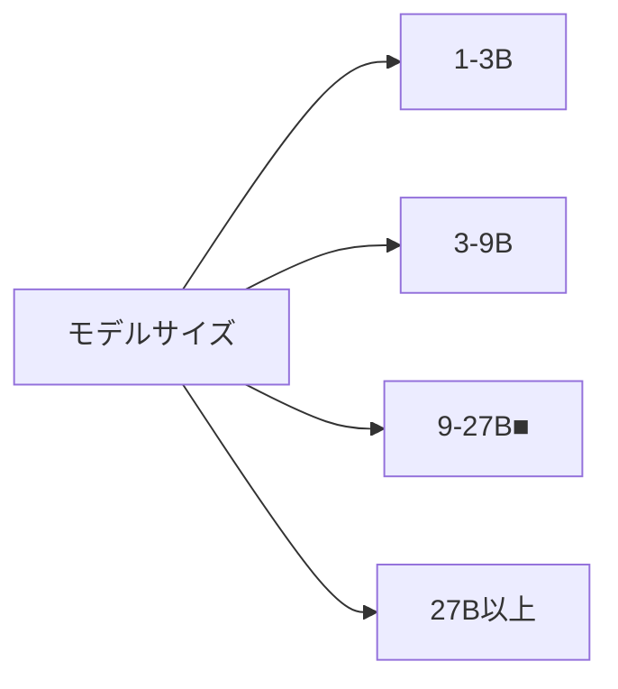
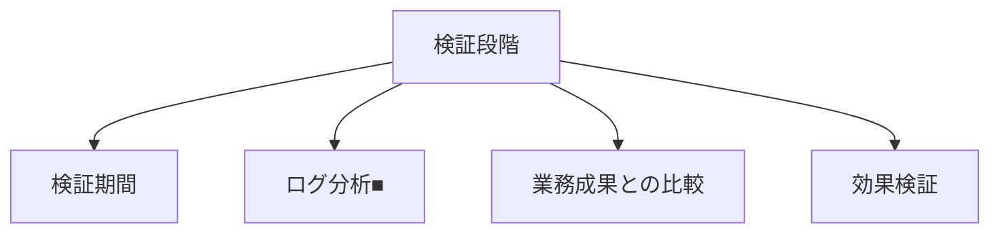
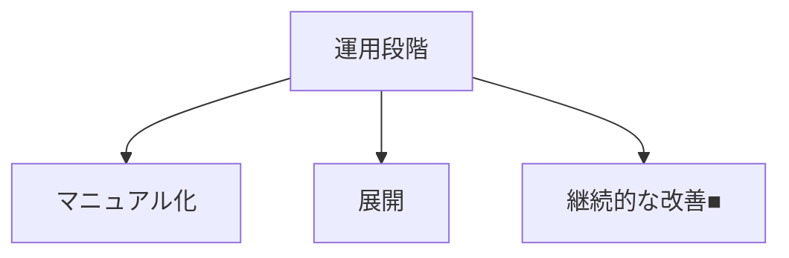
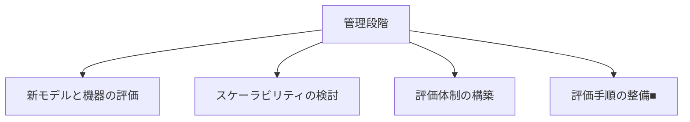
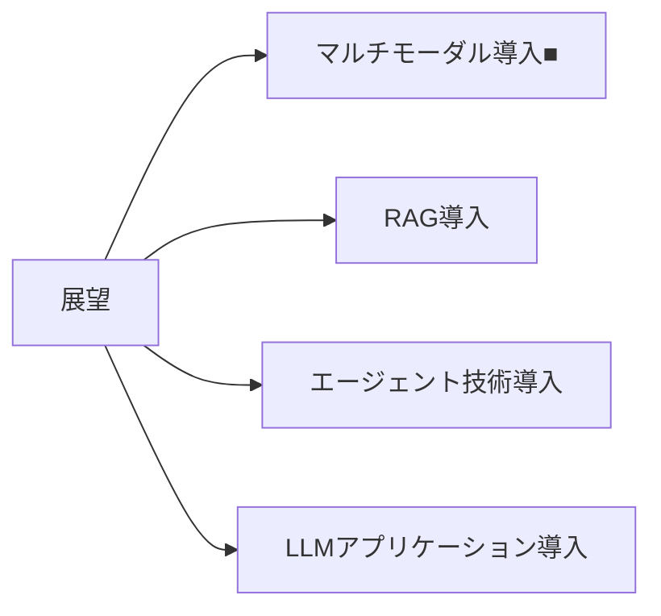

# doc_genai_Using_Generative_AI_with_Mac_Mini_-Introduction-
Mac Miniでの生成AI活用（導入）

  
## 目次

- [はじめに](#はじめに)
- [生成AIの成り立ちや種類について](#生成aiの成り立ちや種類について)
  - [AIの種類](#aiの種類)
  - [生成AIの種類](#生成aiの種類)
  - [生成AIの活用事例](#生成aiの活用事例)
- [LLMの利用形態について](#llmの利用形態について)
  - [LLMの動作環境](#llmの動作環境)
  - [ローカルLLMを動作させる機器](#ローカルllmを動作させる機器)
  - [具体的なユースケース例](#具体的なユースケース例)
- [ローカルLLMの動作環境について](#ローカルllmの動作環境について)
  - [メモリ・演算装置](#メモリ・演算装置)
  - [アプリケーション](#アプリケーション)
  - [モデルサイズ](#モデルサイズ)
- [ローカルLLMの業務利用導入手順について](#ローカルllmの業務利用導入手順について)
  - [検証段階](#検証段階)
  - [運用段階](#運用段階)
  - [管理段階](#管理段階)
- [ローカルLLMの業務利用導入後の展望について](#ローカルllmの業務利用導入後の展望について)
  - [展望](#展望)
  - [まとめ](#まとめ)

  
## はじめに

- Mac Apple siliconにより構成されたMac Miniを用いてローカルLLMによるAIチャット機能を導入し、業務効率化を実現することを目指します。
- 下記図表の印「■」については、この目的に沿って着目するべきキーワードに記しています。
- 下記図表ではキーワードのみ記しているため、詳細をご覧になりたい場合は、各章のリンクをご参照ください。

https://github.com/SparklingDetergent/doc_genai_Using_Generative_AI_with_Mac_Mini_M1_-Server_Setup-

  
## 生成AIの成り立ちや種類について

### AIの種類

  
### 生成AIの種類

  
### 生成AIの活用事例

| 分野 | 活用例 |
|------|--------|
| マーケティング | 広告文言生成 |
| カスタマーサービス | チャットボット |
| 業務■ | レポート作成支援 |
| 教育 | 個別化学習コンテンツ |
| 医療 | 診断支援 |
| エンターテイメント | ゲームシナリオ生成 |

  
## LLMの利用形態について

### LLMの動作環境

**補足**: ローカル環境で動作するLLMについては、Hugging Face等のサイトで配布されているモデルを、ライセンスに応じて利用可能です。

  
### ローカルLLMを動作させる機器

  
### 具体的なユースケース例

| ユースケース | 説明 |
|--------------|------|
| 社内情報検索システム | 社内文書の効率的な検索・要約 |
| 顧客対応チャットボット | 24時間対応の自動応答 |
| コーディング支援■ | プログラミング補助・デバッグ支援 |
| オフライン翻訳 | インターネット接続不要の翻訳 |
| 医療現場での診断支援 | 症状に基づく初期診断補助 |

  
## ローカルLLMの動作環境について

### メモリ・演算装置

| メモリ種類 | 演算装置 |
|------------|----------|
| RAM | CPU |
| VRAM | GPU |
| 共有メモリ■ | CPU, GPU, NPU |

  
### アプリケーション

  
### モデルサイズ

  
## ローカルLLMの業務利用導入手順について

### 検証段階

  
### 運用段階

  
### 管理段階

  
## ローカルLLMの業務利用導入後の展望について

### 展望

  
### まとめ

ローカルLLMの導入により、セキュリティを確保しつつ、業務効率化を実現できます。継続的な評価と改善が重要です。
