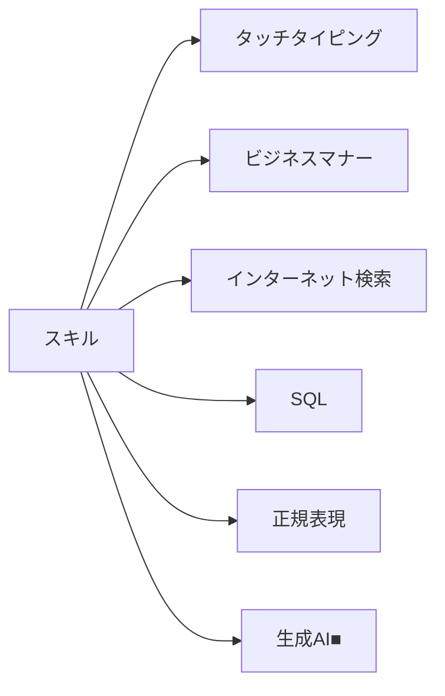
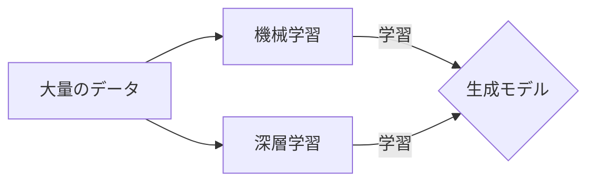
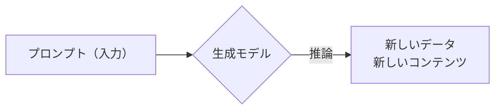
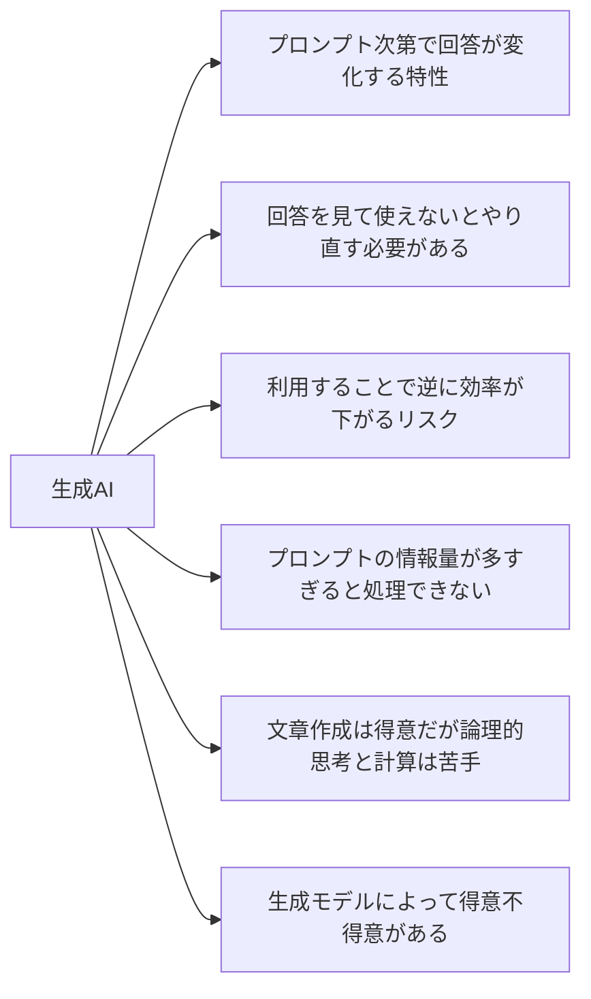
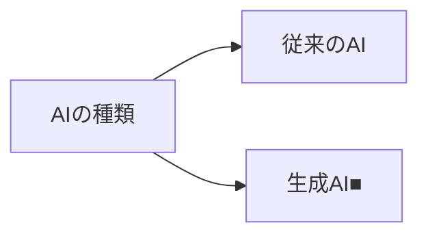

# doc_genai_Using_Generative_AI_with_Mac_Mini_-Introduction-
Mac Miniでの生成AI活用（導入）

  
## 目次

- [はじめに](#はじめに)
- [イメージしていただくために](#イメージしていただくために)
  - [生成AIはスキルの１つ](#生成AIはスキルの１つ)
  - [生成AIの実体は大量の学習データを機械学習により詰め込んだファイル](#生成AIの実体は大量の学習データを機械学習により詰め込んだファイル)
  - [生成AIは入力に対して学習データに近い内容でランダムに回答しているだけ](#生成AIは入力に対して学習データに近い内容でランダムに回答しているだけ)
  - [生成AIを利用するにあたっての留意事項](#生成AIを利用するにあたっての留意事項)
- [生成AIの成り立ちや種類について](#生成aiの成り立ちや種類について)
  - [AIの種類](#aiの種類)
  - [生成AIの種類](#生成aiの種類)
  - [生成AIの活用事例](#生成aiの活用事例)
- [LLMの利用形態について](#llmの利用形態について)
  - [LLMの動作環境](#llmの動作環境)
  - [ローカルLLMを動作させる機器](#ローカルllmを動作させる機器)
  - [具体的なユースケース例](#具体的なユースケース例)
- [ローカルLLMの動作環境について](#ローカルllmの動作環境について)
  - [メモリ・演算装置](#メモリ・演算装置)
  - [アプリケーション](#アプリケーション)
  - [モデルサイズ](#モデルサイズ)
- [ローカルLLMの業務利用導入手順について](#ローカルllmの業務利用導入手順について)
  - [検証段階](#検証段階)
  - [運用段階](#運用段階)
  - [管理段階](#管理段階)
- [ローカルLLMの業務利用導入後の展望について](#ローカルllmの業務利用導入後の展望について)
  - [展望](#展望)
- [まとめ](#まとめ)
- [参考情報](#参考情報)

  
## はじめに

- Mac Apple siliconにより構成されたMac Miniを用いてローカルLLMによるAIチャット機能を導入し、業務効率化を実現することを目指します。
- 下記図表の印「■」については、この目的に沿って着目するべきキーワードに記しています。
- 下記図表ではキーワードのみ記しているため、詳細をご覧になりたい場合は、各章のリンクをご参照ください。

  
## イメージしていただくために
- リンクなし
### 生成AIはスキルの１つ

  
### 生成AIの実体は大量の学習データを機械学習により詰め込んだファイル

  
### 生成AIは入力に対して学習データに近い内容でランダムに回答しているだけ

  
### 生成AIを利用するにあたっての留意事項
- 2024年時点においては、以下のような課題があります。

  
## 生成AIの成り立ちや種類について
https://github.com/SparklingDetergent/doc_genai_About_the_origins_and_types_of_generative_AI/blob/main/README.md
### AIの種類

  
### 生成AIの種類

  
### 生成AIの活用事例

| 分野 | 活用例 |
|------|--------|
| マーケティング | 広告文言生成 |
| カスタマーサービス | チャットボット |
| 業務■ | レポート作成支援 |
| 教育 | 個別化学習コンテンツ |
| 医療 | 診断支援 |
| エンターテイメント | ゲームシナリオ生成 |

  
## ローカルLLMの有用性について
https://github.com/SparklingDetergent/doc_genai_The_usefulness_of_local_LLM/blob/main/README.md
### LLMの動作環境

**補足**: ローカル環境で動作するLLMについては、Hugging Face等のサイトで配布されているモデルを、ライセンスに応じて利用可能です。

  
### ローカルLLMを動作させる機器

  
### 具体的なユースケース例

| ユースケース | 説明 |
|--------------|------|
| 社内情報検索システム | 社内文書の効率的な検索・要約 |
| 顧客対応チャットボット | 24時間対応の自動応答 |
| コーディング支援■ | プログラミング補助・デバッグ支援 |
| オフライン翻訳 | インターネット接続不要の翻訳 |
| 医療現場での診断支援 | 症状に基づく初期診断補助 |

  
## ローカルLLMの動作環境について
https://github.com/SparklingDetergent/doc_genai_About_the_local_LLM_operating_environment/blob/main/README.md
### メモリ・演算装置

| メモリ種類 | 演算装置 |
|------------|----------|
| RAM | CPU |
| VRAM | GPU |
| 共有メモリ■ | CPU, GPU, NPU |

  
### アプリケーション

  
### モデルサイズ

  
## ローカルLLMの業務利用導入手順について
https://github.com/SparklingDetergent/doc_genai_About_the_introduction_procedure_for_business_use_of_LocalLLM/blob/main/README.md
### 検証段階

  
### 運用段階

  
### 管理段階

  
## ローカルLLMの業務利用導入後の展望について
- リンクなし
### 展望

  
## まとめ

ローカルLLMの導入により、セキュリティを確保しつつ、業務効率化を実現できます。継続的な評価と改善が重要です。

  
## 参考情報

- 参考として、Mac Mini M1 のセットアップ手順を示します。
 - https://github.com/SparklingDetergent/doc_genai_Using_Generative_AI_with_Mac_Mini_M1_-Server_Setup-/blob/main/README.md
- 参考として、ログ分析に役立つチャットスクリプトを示します。
 - https://github.com/SparklingDetergent/src_genai_Script_to_use_local_LLM_with_llama.cpp_and_PowerShell

